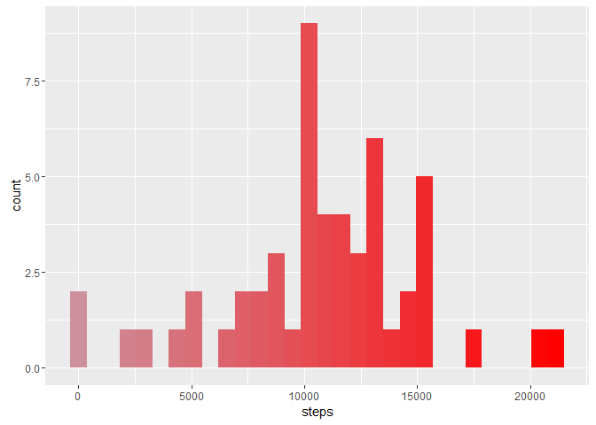
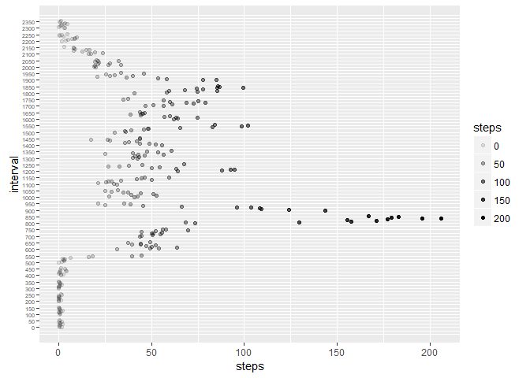
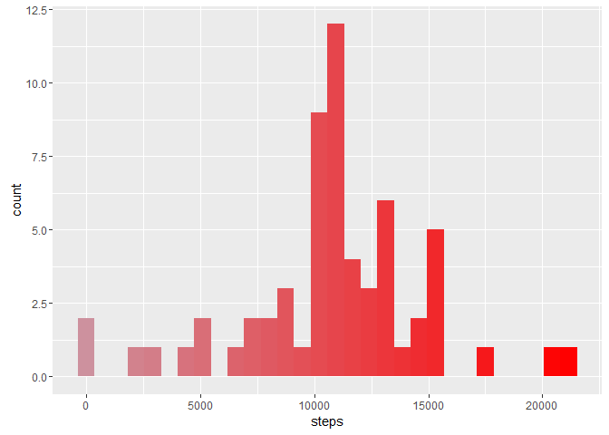

# Reproducible Research: Peer Assessment 1
## <span style="color:blue"> Loading and preprocessing the data text</span>.


```r
data_activity <- read.csv('activity.csv')
```


## <span style="color:blue"> What is mean total number of steps taken per day? </span>

### Calculate the total number of steps taken per day

```r
stepsEachDay <- aggregate(steps ~ date, data_activity, sum)
```

### Histogram of the total number of steps taken each day
<div style="text-align:center;border:solid;">

```r
library(ggplot2)
pal <- colorRampPalette(c('pink3', 'red'))
ggplot(stepsEachDay, aes(steps)) +
  geom_histogram(bins = 30, fill = pal(30))
```

<!-- -->
</div>

### Mean and Median of the total number of steps taken per day

```r
meanStepsEachDay <-  mean(stepsEachDay$steps)

medianStepsEachDay <- median(stepsEachDay$steps)
```
Mean: 10766.1886792453  
Median: 10765


## <span style="color:blue"> What is the average daily activity pattern?</span>

### Time series plot of the 5-minute interval and the average number of steps taken, averaged across all days

```r
meanOfStepsEachInterval <- aggregate(steps ~ interval, data_activity, mean)
```
<div style="text-align:center;border:solid;">

```r
ggplot(meanOfStepsEachInterval, aes(steps, interval, alpha = steps)) +
  geom_point() +
  scale_y_continuous(breaks = seq(0, 2355, by = 50),
                     labels = seq(0, 2355, by = 50)) +
  theme(axis.text.y = element_text(size = 5))
```

<!-- -->
</div>

### 5-minute interval having maximum number of steps

```r
meanOfStepsEachInterval[meanOfStepsEachInterval$steps == max(meanOfStepsEachInterval$steps), ]
```

```
##     interval    steps
## 104      835 206.1698
```


## <span style="color:blue"> Imputing missing values </span>

### Calculate and report the total number of missing values in the dataset

```r
sum(!complete.cases(data_activity))
```

```
## [1] 2304
```

### Strategy for filling in all of the missing values in the dataset
We have filled all the NA's with mean

```r
sum(!complete.cases(data_activity$date)) #No NA in date
```

```
## [1] 0
```

```r
sum(!complete.cases(data_activity$interval))#NO NA in interval
```

```
## [1] 0
```

```r
#NA's are only in steps
meanOfStepsEachInterval <- aggregate(steps ~ interval, data_activity, mean)
data_activity_NA <-
  data_activity[!complete.cases(data_activity), c('interval', 'date')]
NA_filled <-
  merge(data_activity_NA, meanOfStepsEachInterval, by = 'interval')
data_activity_NO_NA <- data_activity[complete.cases(data_activity), ]
```

### Creating a new dataset that is equal to the original dataset but with the missing data filled in

```r
data_activity_Final <- rbind(data_activity_NO_NA, NA_filled)
```

### Histogram of the total number of steps taken each day
<div style="text-align:center;border:solid;">

```r
stepsEachDay_Final <- aggregate(steps ~ date, data_activity_Final, sum)
ggplot(stepsEachDay_Final, aes(steps)) +
  geom_histogram(bins = 30, fill = pal(30))
```

<!-- -->
</div>
### Mean and Median of the total number of steps taken per day

```r
meanStepsEachDay_Final <-  mean(stepsEachDay_Final$steps)
medianStepsEachDay_Final <- median(stepsEachDay_Final$steps)
```
Mean: 10766.1886792453  
Median: 10766.1886792453

There is neglible difference before and after imputing missing values in the mean and median.

## <span style="color:blue"> Are there differences in activity patterns between weekdays and weekends?</span>

### Creating a new factor variable in the dataset with two levels – “weekday” and “weekend”

```r
days <- as.factor(weekdays(as.Date(data_activity_Final$date)))
levels(days) <- c('weekday','weekday','weekend','weekend','weekday','weekday','weekday')
data_activity_Final$dayType <- days
```

### Panel plot containing a time series plot of the 5-minute interval and the average number of steps taken, averaged across all weekday days or weekend days

```r
meanOfStepsEachInterval_Final <- aggregate(steps ~ interval+dayType, data_activity_Final, mean) 
```
<div style="text-align:center;border:solid;">

```r
ggplot(meanOfStepsEachInterval_Final, aes(interval,steps)) +
  geom_line() +
  facet_wrap(~dayType,nrow = 2,ncol = 1)
```

<!-- -->
</div>
